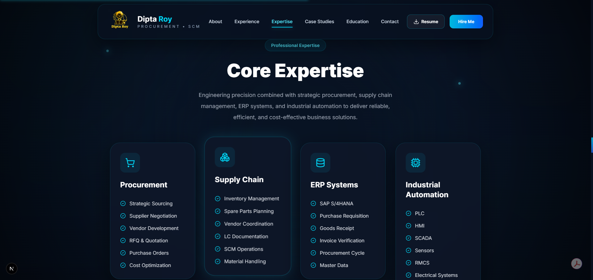
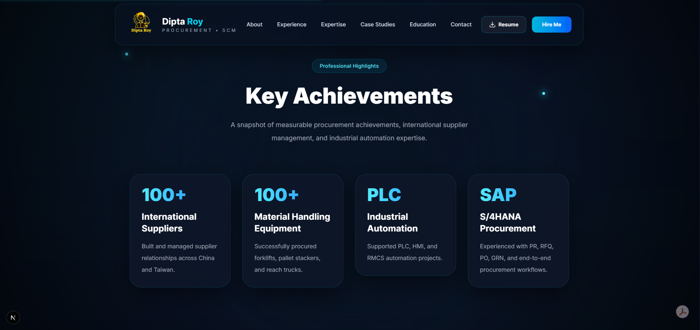

# 🚀 Dipta Roy | Procurement & Supply Chain Portfolio

<p align="center">
  
</p>

<p align="center">
  <strong>Procurement & Supply Chain Professional | Industrial Automation Engineer</strong>
</p>

<p align="center">


</p>

<p align="center">
A modern portfolio showcasing my professional experience in Procurement, Strategic Sourcing, ERP Systems, Supplier Management, Industrial Automation, and Engineering Project Management.
</p>

<p align="center">

<a href="https://diptaroy0.vercel.app">
🌐 Live Portfolio
</a>

&nbsp; | &nbsp;

<a href="https://diptaroy0.vercel.app/resume/Resume.pdf">
📄 Resume
</a>

&nbsp; | &nbsp;

<a href="https://www.linkedin.com/in/diptaroy0">
💼 LinkedIn
</a>

&nbsp; | &nbsp;

<a href="https://github.com/diptaroy0">
💻 GitHub
</a>

</p>

---

# 📖 About

This repository contains my professional portfolio website built with **Next.js 16**, **TypeScript**, **Tailwind CSS v4**, and **Framer Motion**.

The portfolio highlights my professional journey in:

- Procurement & Supply Chain Management
- Strategic Sourcing
- Supplier Relationship Management
- Oracle ERP & SAP S/4HANA
- Industrial Automation
- Engineering Project Management
- Material Handling Equipment Procurement

It reflects both my procurement expertise and my ability to build modern, responsive, and high-performance web applications.

---

# 🎯 Purpose

The objective of this portfolio is to present my professional experience in a modern, engaging, and recruiter-friendly format while demonstrating both technical and business capabilities.

It showcases:

- Professional Experience
- Procurement Projects
- Industrial Automation Projects
- Procurement Case Studies
- Technical Skills
- Education
- Career Achievements

---

# 🌐 Live Website

### Portfolio

👉 **https://diptaroy0.vercel.app**

### Resume

👉 **https://diptaroy0.vercel.app/resume/Resume.pdf**

---

# ⚡ Lighthouse Performance

| Performance | Accessibility | Best Practices | SEO |
|------------:|--------------:|---------------:|----:|
| **100** | **100** | **100** | **100** |

---

# ✨ Features

## Professional Portfolio

- Modern Glassmorphism UI
- Interactive Hero Section
- About Section
- Experience Timeline
- Core Expertise
- Procurement Workflow
- Featured Projects
- Procurement Case Studies
- Education & Certifications
- Resume Download
- Contact Section

## Performance & SEO

- Lighthouse 100/100/100/100
- SEO Optimized
- JSON-LD Structured Data
- Sitemap
- Robots.txt
- Open Graph Support
- PWA Ready

## User Experience

- Fully Responsive
- Smooth Animations
- Optimized Images
- Accessibility Improvements
- Cross-browser Compatible

---

# 🛠 Tech Stack

| Category | Technology |
|------------|------------|
| Framework | Next.js 16 |
| Language | TypeScript |
| Styling | Tailwind CSS v4 |
| Animation | Framer Motion |
| Icons | Lucide React |
| Icons | React Icons |
| Deployment | Vercel |
| Package Manager | npm |

---

# 📂 Project Structure

```text
app/
components/
data/
hooks/
lib/
public/
```

---

# 🚀 Getting Started

## Clone the repository

```bash
git clone https://github.com/diptaroy0/procurement-portfolio.git
```

## Navigate to the project

```bash
cd procurement-portfolio
```

## Install dependencies

```bash
npm install
```

## Start development server

```bash
npm run dev
```

Open:

```
http://localhost:3000
```

---

# 📷 Portfolio Preview

## Hero


---

## About


---

## Expertise



---

## Achievement



---

## Contact


---

# 👨‍💼 Professional Profile

I am an **Electrical & Electronic Engineer** with professional experience in Procurement, Strategic Sourcing, Supplier Development, ERP Systems, Industrial Automation, and Manufacturing Operations.

My expertise combines engineering knowledge with procurement strategy, enabling me to contribute in:

- Strategic Procurement
- Global Supplier Management
- Supplier Relationship Management
- ERP-driven Procurement Processes
- Cost Optimization
- Material Handling Equipment Procurement
- Industrial Automation
- Cross-functional Collaboration
- Manufacturing Excellence

---

# 📬 Contact

**Dipta Roy**

📧 **Email**

diptaroy0@gmail.com

🌐 **Portfolio**

https://diptaroy0.vercel.app

💼 **LinkedIn**

https://www.linkedin.com/in/diptaroy0

💻 **GitHub**

https://github.com/diptaroy0

---

# 📄 License

This repository showcases my personal portfolio and is provided for demonstration purposes.

The design, branding, written content, graphics, and other assets are proprietary to **Dipta Roy** and may not be copied, redistributed, modified, or used commercially without prior written permission.

© 2026 Dipta Roy. All Rights Reserved.

---

<p align="center">

### ⭐ If you like this portfolio, consider giving the repository a star!

Designed & Developed with ❤️ by **Dipta Roy**

</p>