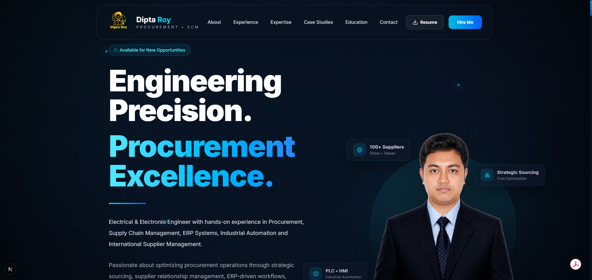
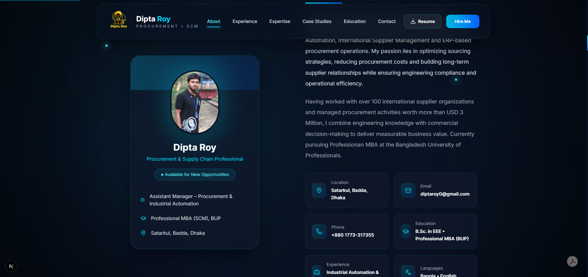
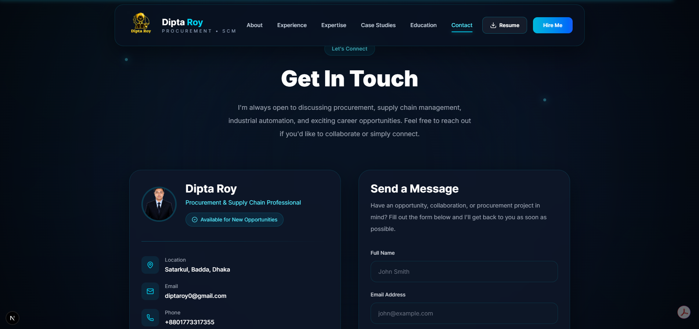

# 🚀 Dipta Roy | Procurement & Supply Chain Portfolio

<p align="center">
  <strong>Procurement & Supply Chain Professional | Industrial Automation Engineer</strong>
</p>

<p align="center">
  A modern portfolio showcasing experience in Procurement, Strategic Sourcing, ERP Systems, Supplier Management, and Industrial Automation.
</p>

<p align="center">
  <a href="https://diptaroy0.vercel.app/" target="_blank">
    🌐 Live Portfolio
  </a>
  &nbsp; | &nbsp;
  <a href="https://diptaroy0.vercel.app/resume/Resume.pdf" target="_blank">
    📄 Resume
  </a>
  &nbsp; | &nbsp;
  <a href="https://www.linkedin.com/in/diptaroy0/" target="_blank">
    💼 LinkedIn
  </a>
  &nbsp; | &nbsp;
  <a href="https://github.com/diptaroy0" target="_blank">
    💻 GitHub
  </a>
</p>

---

## 📖 About

This repository contains my professional portfolio website, built with **Next.js 16**, **TypeScript**, and **Tailwind CSS**.

The portfolio highlights my professional experience in:

- Procurement & Supply Chain Management
- Strategic Sourcing
- Supplier Development
- Oracle ERP & SAP S/4HANA
- Industrial Automation
- Engineering Project Management
- Material Handling Equipment Procurement

It demonstrates both my professional experience and my ability to build modern, responsive web applications.

---

## 🎯 Purpose

The goal of this portfolio is to present my professional journey in an interactive and engaging way while showcasing:

- Professional experience
- Procurement projects
- Industrial automation expertise
- Case studies
- Technical skills
- Education
- Career achievements

---

# 🌐 Live Website

### Portfolio

👉 **https://diptaroy0.vercel.app**

### Resume

👉 **https://diptaroy0.vercel.app/resume/Resume.pdf**

---

# ✨ Features

- Modern Glassmorphism UI
- Fully Responsive Design
- Procurement-focused Professional Branding
- Interactive Hero Section
- About Section
- Professional Experience Timeline
- Core Expertise
- Procurement Workflow
- Featured Projects
- Case Studies
- Education & Certifications
- Resume Download
- Contact Section
- Smooth Animations
- SEO Optimized
- JSON-LD Structured Data
- PWA Ready
- Accessibility Improvements

---

# 🛠 Tech Stack

| Category | Technology |
|------------|------------|
| Framework | Next.js 16 |
| Language | TypeScript |
| Styling | Tailwind CSS v4 |
| Animation | Framer Motion |
| Icons | Lucide React & React Icons |
| Deployment | Vercel |
| Package Manager | npm |

---

# 📂 Project Structure

```text
app/
components/
data/
hooks/
lib/
public/
```

---

# 🚀 Getting Started

## Clone the repository

```bash
git clone https://github.com/diptaroy0/procurement-portfolio.git
```

## Navigate to the project

```bash
cd procurement-portfolio
```

## Install dependencies

```bash
npm install
```

## Start development server

```bash
npm run dev
```

Open your browser and visit:

```
http://localhost:3000
```

---

# 📷 Portfolio Preview

> Replace these images after uploading screenshots to the repository.

## Hero



---

## About



---

## Experience


---

## Projects


---

## Contact



---

# 👨‍💼 Professional Profile

I am an **Electrical & Electronic Engineer** with professional experience in Procurement, Strategic Sourcing, Supplier Development, Industrial Automation, ERP Systems, and Manufacturing Operations.

My experience combines engineering knowledge with procurement expertise, enabling me to support:

- Strategic Procurement
- Global Supplier Management
- ERP-driven Procurement Processes
- Cost Optimization
- Material Handling Equipment Procurement
- Industrial Automation Projects
- Cross-functional Collaboration
- Manufacturing Excellence

---

# 📬 Contact

**Dipta Roy**

📧 Email  
**diptaroy0@gmail.com**

🌐 Portfolio  
https://diptaroy0.vercel.app/

💼 LinkedIn  
https://www.linkedin.com/in/diptaroy0/

💻 GitHub  
https://github.com/diptaroy0

---

# 📄 License

This repository is intended for portfolio and demonstration purposes.

The source code may not be copied, redistributed, modified, or used commercially without prior written permission.

© 2026 Dipta Roy. All Rights Reserved.